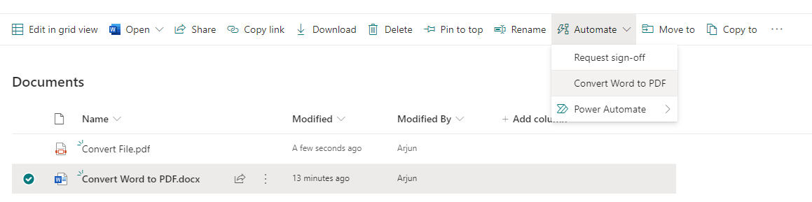
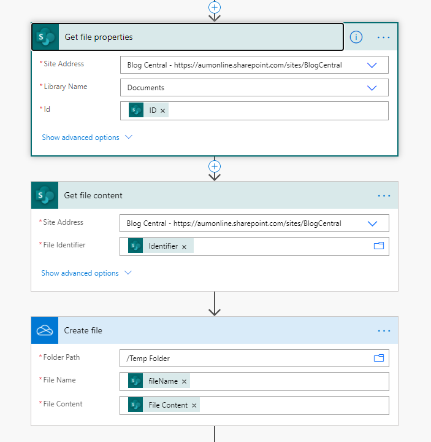
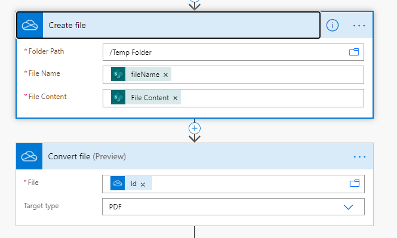
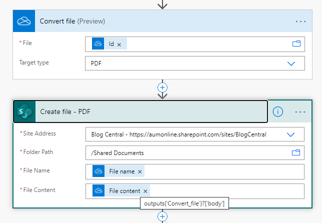
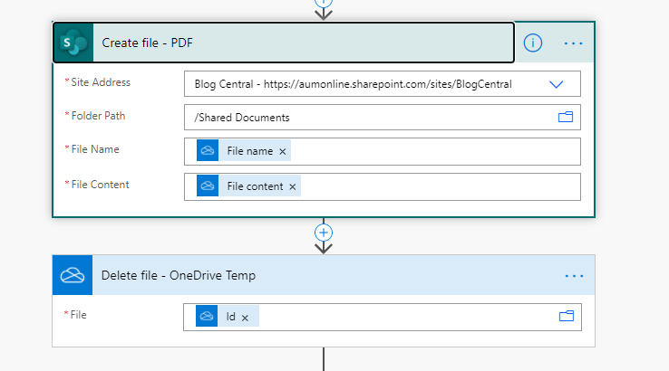
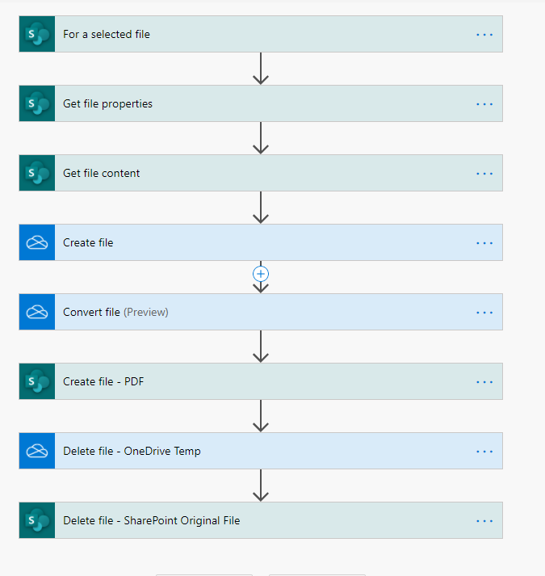

Have you faced a situation where you want to convert a Microsoft Word document in SharePoint Document Library to PDF using Power Automate? When you check the Power Automate Actions, you see that there are no actions available _(at least when I write this blog)_ which converts Microsoft word document to PDF from SharePoint. But fortunately for us, the connector is available for OneDrive for Business files. So our approach would be something like below

## Approach

 1. Get the file from SharePoint Document library.
 2. Copy the file to a Temporary Folder in OneDrive for Business.
 3. Convert the Word file to PDF using **[Convert File](https://docs.microsoft.com/en-us/connectors/onedriveforbusiness/#convert-file-(preview)){:target="_Blank"}** action of OneDrive.
 4. Copy / Create the converted file from OneDrive to your SharePoint Document library.
 5. Delete the word file and PDF file from your temporary folder of OneDrive for Business.

### 1. Get file from SharePoint Document Library

In my case, my trigger for the Power Automate was **[For a selected file](https://docs.microsoft.com/en-us/connectors/sharepointonline/#for-a-selected-file){:target="_blank"}** in SharePoint document library. Once I initiate Power Automate, the file would be read and the process continues

### 2. Copy the file to OneDrive

Since SharePoint doesn’t have the **Action** component for converting word to PDf, we have to copy the file to a Temporary folder in your OneDrive.

In the above section,

 1. This control will get the properties since **Create File** of
    OneDrive needs File Content.
 2. This component gets the File Content
 3. This will create the file in your OneDrive in a folder called **Temp
    Folder**

After completion of the above steps, you would have a Word document created

### 3. Convert Word file to PDF

Here you use **[Convert File](https://docs.microsoft.com/en-us/connectors/onedriveforbusiness/#convert-file-(preview)){:target="_Blank"}** control of OneDrive for business through which you can convert any word file which is there in your OneDrive.

*`At the time of writing this blog, Convert File Action is currently on Preview. But it will serve the purpose without any issue`*

### 4. Created the converted PDF file in SharePoint Document library

Once the file is converted, you can create the converted file in your SharePoint document library.

The above steps would have created a PDF file in your document library

### 5. Delete the file form OneDrive Temp Folder

**_Please make sure you are deleting the Temp_** _**file which you had created in your OneDrive**_.

_You can also delete the original word document if your business process requires that so that original word document which is there in the library will not be available._

## Complete Power Automate Process

Following is the complete Power Automate for the conversion process. You can see that number of controls for the simple conversion is on a higher end which is due to the unavailability of the **Convert File** control in SharePoint. If your conversion process needs to be done in your OneDrive, you would hardly have 3 **Action Components** in your Power Automate.

Photo by [Drew Coffman](https://unsplash.com/@drewcoffman?utm_source=unsplash&utm_medium=referral&utm_content=creditCopyText){:target="_blank"} on Unsplash
