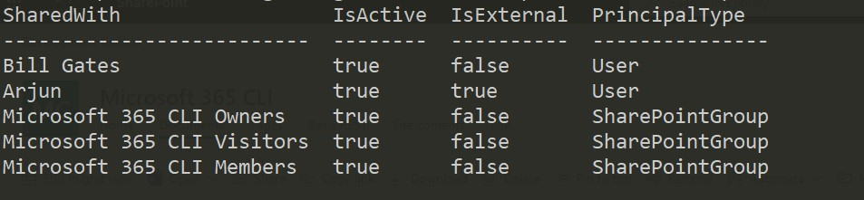

Have you struggled a way to know the Sharing Information details for a particular file which is there in *SharePoint Online* or *OneDrive for Business*? Have you wondered and thought about a way where you need to know to which all users a SharePoint Online Document Library file or a OneDrive file has been shared with? Or you want to quickly know the the shared information details of a particular file in your OneDrive

 Well the first thing which comes to your mind is to go look in the **Manage Access** approach from the User Interface of File sharing settings. It does gives you a high-level information about the shared files. But this may get difficult if you want to know how many of those users were external. Well, using User Interface you will not get that information and there you have reached a difficult situation.
You will also find it difficult to know about shared details if the file is shared via Direct Link

There comes [CLI for Microsoft 365](https://aka.ms/cli-m365){:target="_blank"} for your rescue. With CLI for Microsoft 365, there is a command via which you can get the complete sharing report which you will fetch the result something like below.



When you execute the command

```shell
m365 spo file sharinginfo get --webUrl https://arjunumenon.sharepoint.com/sites/M365CLI --url "/sites/M365CLI/Shared Documents/MySharingCentral.docx"
```

How good is that. You can get the complete sharing details which even has external sharing information in a single command.

## Information Not Enough

If you are not happy with the currently available information available as text output, you can even get the JSON output from CLI for Microsoft 365 commands via which you can manipulate and process complete business scenarios. For getting the complete Sharing Information result in a JSON object, you can use the below command

```shell
m365 spo file sharinginfo get --webUrl https://arjunumenon.sharepoint.com/sites/M365CLI --url "/sites/M365CLI/Shared Documents/MySharingCentral.docx" --output JSON
```

You can get more details about this command from [this link](https://pnp.github.io/cli-microsoft365/cmd/spo/file/file-sharinginfo-get/){:target="_blank"}.

Photo by [San Kaÿzn](https://unsplash.com/@sankayzn?utm_source=unsplash&amp;utm_medium=referral&amp;utm_content=creditCopyText){:target="_blank"} on Unsplash
