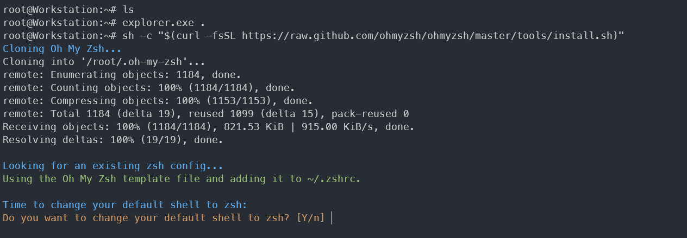
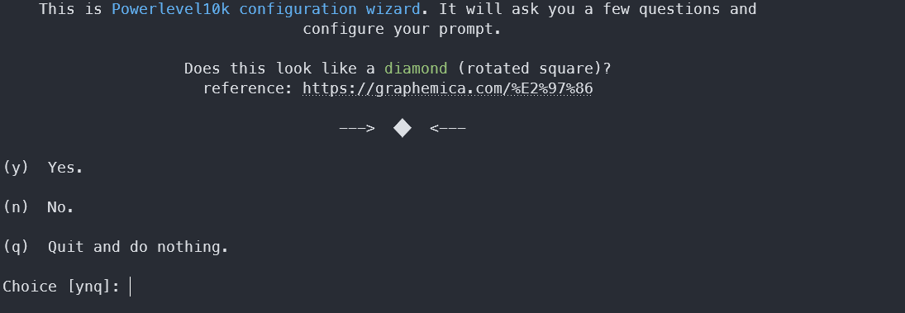
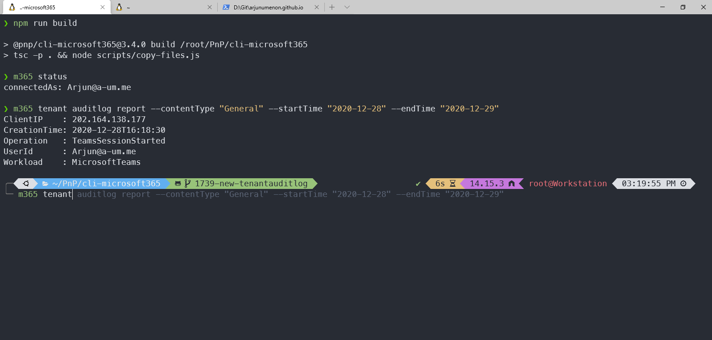

Ever since the release of [WSL (Windows Subsystem for Linux)](https://docs.microsoft.com/en-us/windows/wsl/about){:target="_blank"}, it has been all over the news and the beatiful flavour of Linux which could be used via Windows. I am not going into the benefits of the WSL and its grip over the performance. In this blog, I will talk through the tips & trips and the ways how you can beautify your terminal which shows the needed information in your terminal in quick glance.

## Install WSL

I am not going into the details on how do you setup WSL in Windows 10. There is a great [Microsoft Docs article](https://docs.microsoft.com/en-us/windows/wsl/install-win10){:target="_blank"} which has explained on how to do that

## Terminal before setup

Before you configure the steps mentioned below, all you get is a terminal window something below.


## Configure WSL

### 1. Make Ubuntu as Default Profile

Since we are focusing on setting up WSL terminal, it is best to keep your Ubuntu Linux terminal as the default terminal. Once you do that, the moment you open Windows Terminal, Ubuntu Window will get opened.

1. Click Settings of the Terminal
2. That will open a JSON file
3. You can see the list of Profiles in the JSON file
4. Update the `defaultProfile` to be the GUID of the Ubuntu Profile


### 2. Change default directory for Linux

By default after configuring Linux, it will be configured to open your default profile folder which will be something like this ```/mnt/c/Users/yourusername```

According to [this post](https://www.hanselman.com/blog/its-time-for-you-to-install-windows-terminal){:target="_blank"} by the Super Nerd [Scott Hanselman](https://twitter.com/shanselman){:target="_blank"},

>
> performance in WSL is lightning fast if your source code is in your Ubuntu / Linux mount under ~.
> If your source is under /mnt/c or /mnt anywhere, the git calls being made to populate the prompt are super slow.
> Be warned. Do your Linux source code/git work in the Linux filesystem for speed until WSL2 gets the file system faster under /mnt

For you to update the default directory, we need to update the [Windows Terminal Profile Settings](https://docs.microsoft.com/en-us/windows/terminal/customize-settings/profile-settings){:target="_blank"} for Ubuntu.

1. Type `cd ~` in your terminal
2. Then type `explorer.exe .`
3. This will open windows explorer of your default terminal
4. Copy the location from the addressbar which will be something like this `\\wsl$\Ubuntu-20.04\root`
5. In your Ubuntu Profile, add the attribute named `startingDirectory` and add the root address there
   1. Make sure you change `\` from the copied address to `/` which is the equivalent of Linux
6. After the change, your Ubuntu Profile may look something like below

```json
  "profiles": [
    {
      "guid": "{07b52e3e-de2c-5db4-bd2d-ba144ed6c273}",
      "hidden": false,
      "name": "Ubuntu-20.04",
      "source": "Windows.Terminal.Wsl",
      "startingDirectory": "//wsl$/Ubuntu-20.04/root"
    },
    {
      "guid": "{0caa0dad-35be-5f56-a8ff-afceeeaa6101}",
      "name": "cmd",
      "commandline": "cmd.exe",
      "hidden": false
    }
  ]
  ```

### 3. Add themes to your terminal

  We all like our terminal to look beautiful, don't we. You can even configure the theme in your Terminal settings. All you need to do is to add a `colorScheme` attribute something like below
  ```"colorScheme": "One Half Dark"```. I personally like the theme called "One Half Dark". There are lot of default themes which is provided by Microsot which could be viewed from [HERE](https://docs.microsoft.com/en-us/windows/terminal/customize-settings/color-schemes#included-color-schemes){:target="_blank"}

#### Custom theme

  You can even add a custom theme if you would like to. Custom theme could be added in the attribute called `schemes` and one of such theme would look something like below after you add in the `schemes` section .

```json
"schemes": [
  {
      "name": "Atom One Dark",
      "background": "#282C34",
      "foreground": "#CCCCCC",
      "black": "#000000",
      "blue": "#61AFEF",
      "brightBlack": "#5C6370",
      "brightBlue": "#61AFEF",
      "brightCyan": "#56B6C2",
      "brightGreen": "#98C379",
      "brightPurple": "#C678DD",
      "brightRed": "#E06C75",
      "brightWhite": "#FFFFFF",
      "brightYellow": "#D19A66",
      "cyan": "#56B6C2",
      "green": "#98C379",
      "purple": "#C678DD",
      "red": "#E06C75",
      "white": "#ABB2BF",
      "yellow": "#D19A66"
    }
  ]
  ```

### 4. Install zsh

Another installation which you may need is `zsh`. `zsh` is another shell like `Bash` or `SH`. `zsh` provides more flexibility for your shell and you can configure themes and other settings pretty easily using `zsh`.
For installing zsh, you can execute below command,

```bash
sudo apt-get install zsh
```

### 5. Install Oh My Zsh

[Oh My Zsh](https://ohmyz.sh/){:target="_blank"} is an open source community-driven framework for managing your zsh configuration. For installing the same, [this installation guide](https://ohmyz.sh/#install){:target="_blank"} has given multiple options where you can install `Oh My Zsh`.
During the process, you may see below screens and it is totally normal. All we are doing is that, we are making `Oh My Zsh` as the default shell configuration



### 6. Install VS Code (Visual Studio Code)

If you are like me, you will definitely love Visual Studio Code as a default editor for project files. For you to install VS Code in your WSL, all you need to do is to type in `code .`. That will prompt installation and would be completed once you accept that.

### 7. Other Development Tools

Before we start installing plug-ins and beautifying the terminal, let us install some of the development tools or Command Line Interfaces to make our life super easy

#### Node Version Manager (NVM)

NVM is a tool which is needed if you want to develop multiple applications which use different node versions. Say for e.g., you want to develop SPFx components for your SharePoint Online, then we need to use Node 10.x version.
If you want to contribute to CLI for Microsoft 365, then we may need Node version > 12.0.0. In these kind of situations, NVM comes to your rescue where you can easily switch node versions.

##### Installing NVM

For installing NVM, you need to.

1. Execute the command `curl -o- https://raw.githubusercontent.com/nvm-sh/nvm/v0.37.2/install.sh | bash`
2. Ensure that `NVM_DIR` attribute is added in `./zhrc` file
   1. Execute `code ~/.zshrc`
   2. Ensure the below code is available in the opened file

```bash
  export NVM_DIR="$([ -z "${XDG_CONFIG_HOME-}" ] && printf %s "${HOME}/.nvm" || printf %s "${XDG_CONFIG_HOME}/nvm")"
[ -s "$NVM_DIR/nvm.sh" ] && \. "$NVM_DIR/nvm.sh" # This loads nvm
```

>IF the above snippet is not  available in .zshrc file, add the above code so that the command `nvm` works when terminal is loaded

#### Install Node version and alias it

There is a brilliant way where you can alias Node versions using NVM. This was a brilliant tip which I saw in [Garry Trinder's](https://twitter.com/garrytrinder){:target="_blank"} blog about [Setting up WSL 2](https://garrytrinder.github.io/2020/12/my-wsl2-windows-terminal-setup){:target="_blank"} where he has shown this tip when you quickly want to switch the node versions. There are also many other cool tips available in [his blog](https://garrytrinder.github.io/2020/12/my-wsl2-windows-terminal-setup){:target="_blank"} where you can use in your terminal

```bash
nvm install 14
nvm alias default 14
nvm alias cli-m365 14
```

The above snippet will install node version 14.0 and will alias it with `cli-m365`. Super cool tip isn't it.

Similarly you can install other node versions and set the alias for them. Something like below,

```bash
nvm install 10
nvm alias spfx-spo 10
```

### 8. Install Plugins

There are many plug-ins which you can install which will make your life as a developer super easy. I am giving the list of some of the plug-ins which I have installed in mine

#### zsh-highlight

[zsh-highlight](https://github.com/zsh-users/zsh-syntax-highlighting){:target="_blank"} is one cool plug-in which will highlight your commands with different colour so that you can avoid any typos while you code.

Once you have installed the plug-in, follow the steps below so that it gets loaded everytime you open terminal

1. Type in `code ~/.zshrc`
2. This will open `.zhrc` file where you will configure the plug-ins
3. Add the plug-in name `zsh-syntax-highlighting` to the attribute named "plugins"
4. Your plugins may look something like below after adding
5. Save the changes

> **PS : Ensure to re-open the terminal to have the changes reflected in the terminal**

```bash
plugins=(git zsh-syntax-highlighting)
```

##### Before Using Plug-in


##### After using Plug-In


*You will notice that command `npm` in the above screen is showing in green colour. This will be handy when you type a command and ensure that the command exists by looking at the colour.*

#### zsh-autosuggestions

zsh-autosuggestions is a great plug-in which suggests commands as you type based on history and completions. This will be super helpful when you are developing CLI commands like CLI for Microsoft 365 and you want to test that out without retyping the whole command again and again.
You can install it using [Oh My Zsh approach](https://github.com/zsh-users/zsh-autosuggestions/blob/master/INSTALL.md#oh-my-zsh){:target="_blank"} or any other approach mentioned in the [installation guide](https://github.com/zsh-users/zsh-autosuggestions/blob/master/INSTALL.md){:target="_blank"}

>*Tip : Make sure the you have added the plug-in information in zhrc file and once you have finished adding,  your zhrc file may look something like below*
>
>```bash
>plugins=(git zsh-autosuggestions zsh-syntax-highlighting)
>```

Once installation is complete and you have re-opened the terminal, your auto-suggestion may work as expected.


### 9. Install Themes

The biggest adwantage of the Oh My Zsh is the ability to install beatiful themes. With the themes, you can have all the needed informations like, Git Status, Node Version, Package Version, Execution Time etc shown in the shell. This is will helpful when you want to see the needed information in single screen without executing another command to know the status.

#### Theme - Powerlevel10k

In my case, I have used a theme called [Powerlevel10k](https://github.com/romkatv/powerlevel10k){:target="_blank"} which has super cool features with the theme.
Installation for the theme is super easy, you can use the installation of the theme using [Oh My Zsh approach](https://github.com/romkatv/powerlevel10k#oh-my-zsh){:target="_blank"}.
Once the installation is complete, ensure that the theme in the .zhrc file is changed to the new theme. So the theme attribute may look something like below.

```bash
#ZSH_THEME="robbyrussell"
ZSH_THEME="powerlevel10k/powerlevel10k"
```

*In the above case, I have commented the original theme `robbyrussell`. It is not necessary, you can even remove that line all together.*

##### Fonts

It is recommended to install the font named `Meslo Nerd Font` since it works well with the theme. During the first configuration, prompt may ask whether to install the recommended fonts. If you give **YES**, the fonts will be installed automatically.
You can also manually install the fonts using [this instructions](https://github.com/romkatv/powerlevel10k#manual-font-installation){:target="_blank"} as well.

**After the installation of font, esure that the attribute `"fontFace": "MesloLGS NF"` and `"fontSize": 14` is added in the `settings.json`. Your final Profile settings may look something like below**

```json
  "profiles": [
    {
      "guid": "{07b52e3e-de2c-5db4-bd2d-ba144ed6c273}",
      "hidden": false,
      "name": "Ubuntu-20.04",
      "source": "Windows.Terminal.Wsl",
      "startingDirectory": "//wsl$/Ubuntu-20.04/root",
      "fontFace": "MesloLGS NF",
      "fontSize": 14,
      "colorScheme": "One Half Dark"
    },
    {
      "guid": "{0caa0dad-35be-5f56-a8ff-afceeeaa6101}",
      "name": "cmd",
      "commandline": "cmd.exe",
      "hidden": false,
      "fontFace": "MesloLGS NF",
      "fontSize": 14,
      "colorScheme": "Atom One Dark"
    }
  ]
```

##### Configuration Wizard

One of the biggest advantage of this theme is that - you can design how the shell looks using a User Interface. The theme configuration manager will ask set of questions and will show how the screens looks like. You can easily customize the theme without editing the theme file which I loved about this. You can also modify the theme at any point of time. Some of the cool configurations which I loved about this theme are

* Git Controls
* Arrow Configurations
* Line Spacing
* 24 hour / 12 Hour time

Once you have configured everything, your screen may look something like below


#### Other themes

If you are not happy with the theme exlained here, there are also other themes which you can refer from [Oh My Zsh themes](https://github.com/ohmyzsh/ohmyzsh/wiki/Themes){:target="_blank"} and you can easily install and configure the same based on your requirement.

## Terminal After the setup

Once your setup is complete, your terminal will look something like below.



### Running Version of the WSL2 Terminal

_Please note that the icons in the below screen recordings are not shown properly. It is an issue with the screen recording. Once you have configured everything properly, it will be shown correctly_

<script id="asciicast-mkt8Cvqweh8I4aU89bz353eAN" src="https://asciinema.org/a/mkt8Cvqweh8I4aU89bz353eAN.js" async></script>

Trust me, with this terminal in place you can really feel the difference in the run and build performance for your projects. So why wait? Start setting up the terminal. All it takes is less than half an hour for all the above steps.

Let me know how did the configuration go.
