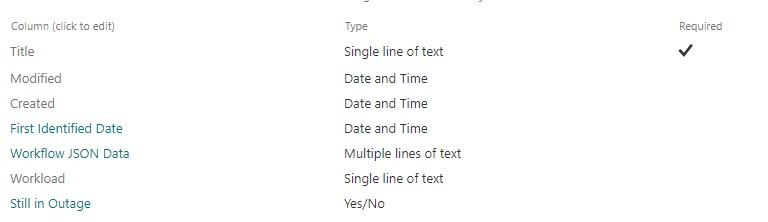
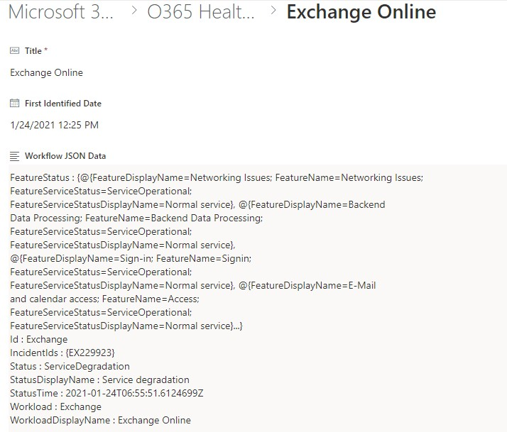
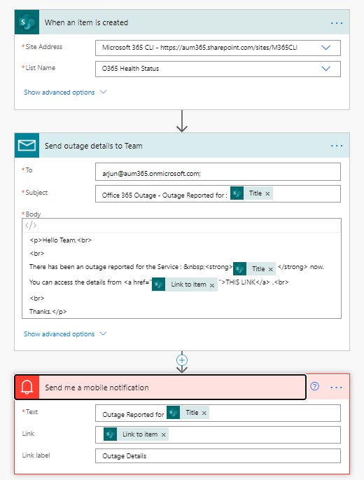
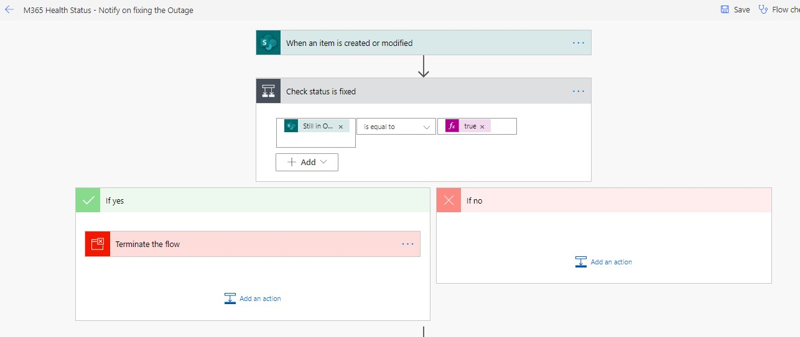
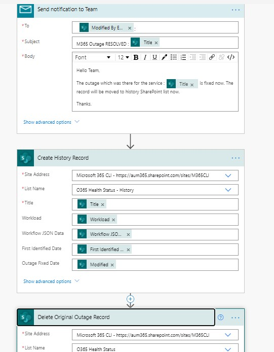

Are you an IT Pro who wants to have a solution which checks the status of your Microsoft 365 Tenant.

How about if you get notified when something goes wrong in your tenant and you gets that information before your users complain. Awesome, right?

## Solution

In this blog, I am showing a way where you can schedule a script which will check the status of your tenant. If something is not right in the tenant, it will save the information to a SharePoint List and will notify the user. I am also giving a bonus solution where I have created a simple Power Automate which will identify the changes and will complete some of the process which is designed for notification

[CLI for Microsoft 365](https://pnp.github.io/cli-microsoft365/){:target="_blank"} provides some powerful and lightweight commands via which you can get the health status of your Office 365 Tenant. With the combination multiple commands, you can create a full fledged and powerful solution through which you can get updates, notified if some of the services are not working as expected.

In this blog, I am using Windows for showing the use case. You as a user are not restricted to use PowerShell since [CLI for Microsoft 365 is a cross-platform CLI](https://pnp.github.io/cli-microsoft365/about/why-cli/){:target="_blank"} and is independent of the OS platform which you uses.

## Index

- [Solution](#solution)
- [Index](#index)
- [Implementation](#implementation)
  - [Authentication and Login](#authentication-and-login)
  - [Get status of Tenant](#get-status-of-tenant)
  - [Pushing to SharePoint list when Services are not normal](#pushing-to-sharepoint-list-when-services-are-not-normal)
    - [SharePoint List](#sharepoint-list)
    - [Adding to SharePoint List if a Service is not Normal](#adding-to-sharepoint-list-if-a-service-is-not-normal)
  - [Send email to any users using CLI for Microsoft 365](#send-email-to-any-users-using-cli-for-microsoft-365)
    - [Send email when the service is NOT Operational](#send-email-when-the-service-is-not-operational)
    - [Send email when the service is back to Operational](#send-email-when-the-service-is-back-to-operational)
- [Bonus Solution - Configure Power Automate for doing any Business Process](#bonus-solution---configure-power-automate-for-doing-any-business-process)
  - [Power Automate - Creation Trigger](#power-automate---creation-trigger)
  - [Power Automate - On Modified](#power-automate---on-modified)
- [PowerShell Scripts](#powershell-scripts)
  - [Complete Script - Easily understandable](#complete-script---easily-understandable)
  - [Simple Script - Production Ready (Lines of Code : 4)](#simple-script---production-ready-lines-of-code--4)
- [Schedule the script](#schedule-the-script)
- [Need to know more on how to use CLI for Microsoft 365](#need-to-know-more-on-how-to-use-cli-for-microsoft-365)

## Implementation

### Authentication and Login

Biggest advantage CLI for Microsoft 365 has is its ability to [Persist Connection Information](https://pnp.github.io/cli-microsoft365/concepts/persisting-connection/){:target="_blank"}. After logging in to Microsoft 365, the CLI for Microsoft 365 will persist the information about the connection until you explicitly log out from Microsoft 365
Once you have authenticated to the tenant, your scripts will be executed without the need for authentication everytime. Since the solution is not a confidential or Complex business Process, it is safe to go ahead with this approach. CLI for Microsoft 365 also provides [Logging in with Certificate](https://pnp.github.io/cli-microsoft365/user-guide/connecting-office-365/#log-in-using-a-certificate){:target="_blank"} if you prefer that approach.

### Get status of Tenant

First step for the script is to get the current status using [tenant status list](https://pnp.github.io/cli-microsoft365/cmd/tenant/status/status-list/){:target="_blank"} command. In our case, we just want to get the services which are not normal.
Here, we use the tenant status list command and would pass [JMESPath Query](https://jmespath.org/){:target="_blank"} since CLI for Microsoft 365 supports that. This query is supported in cross platform as well. We will retrieve all the services which are not running normally and hence we would the JMESPath query would be something like `?Status != 'ServiceOperational'`.

Based on that, our command may look something like below

``` shell
m365 tenant status list --query "value[?Status != 'ServiceOperational']"  --output json
```

>>Another biggest advantage of CLI for Microsoft 365 is that, all the command provides an option for you to [return the values in a JSON string](https://pnp.github.io/cli-microsoft365/user-guide/cli-output-mode/#json-output-mode){:target="_blank"}. With JSON, it is super powerful and flexible and you can easily manipulate the data in your scripts

### Pushing to SharePoint list when Services are not normal

#### SharePoint List

Here we are using a SharePoint List in one of the SharePoint site. Advantage of that is, you can have the information kept and you can tag it to a Power Automate if you want build some Logics (I have created a [Power Automate solution](#bonus-solution---configure-power-automate-for-doing-any-business-process) so that can have a look into that and design your requirements accordingly).
In my case, SharePoint List look something like below



#### Adding to SharePoint List if a Service is not Normal

We will be using [spo listitem add](https://pnp.github.io/cli-microsoft365/cmd/spo/listitem/listitem-add/){:target="_blank"} which will add the item to SharePoint List.
Since we are already authenticated to your tenant, all we need to do is to use the command directly.
Before we do that, we will just check the current SharePoint list whether the outage is already added. Our plan is to have the script running in a fixed interval, say every **15 minutes** or **30 minutes**. In that case there is a chance that outage is still there and we do not need the entry to be duplicated.
So we would get the items from the current SharePoint List using the command [spo listitem get](https://pnp.github.io/cli-microsoft365/cmd/spo/listitem/listitem-get/){:target="_blank"} and will check whether the current outage is already there in the List.

- If it is there,
  - Then we will not do anything.

- If the entry is not there,
  - we will use the command `spo listitem add` and add the status information to SharePoint List

The complete command may look something like below,

``` shell
$workLoads = m365 tenant status list --query "value[?Status != 'ServiceOperational']"  --output json  | ConvertFrom-Json
$currentOutageServices = (m365 spo listitem list --webUrl $webURL --title $listName --fields "Title, Workload, Id"  --output json).Replace("ID", "_ID") | ConvertFrom-Json

#Adding items if any of the workload is not available
$workLoads | ?{$_.Workload -notin $currentOutageServices.Workload} | %{ $addedWorkLoad = m365 spo listitem add --webUrl $webURL --listTitle $listName --contentType Item --Title $_.WorkloadDisplayName --Workload $_.Workload --FirstIdentifiedDate (Get-Date -Date $_.StatusTime -Format "MM/dd/yyyy HH:mm") --WorkflowJSONData (Out-String -InputObject $_ -Width 100) }
```

**Quick Tip** : If you are trying to get JSON output to a PowerShell object, ensure that you are giving the command `.Replace("ID", "_ID")`. This is done because when SharePoint REST API returns the data, return information do have 2 ID fields and when you try to build object from JSON, you will get an error because of a duplicate ID type.

You can see that, we are even pushing the JSON Data of the complete status information so that you as an IT Pro will have detailed logs without going to the Admin Center.
Once you have the data pushed, your status information for a particular outage may look something like below.


### Send email to any users using CLI for Microsoft 365

#### Send email when the service is NOT Operational

CLI for Microsoft 365 gives us the power of sending an email using the command [outlook sendmail](https://pnp.github.io/cli-microsoft365/cmd/outlook/mail/mail-send/){:target="_blank"}. With this command, it uses the logged in user's outlook to send an email.

*Super Tip : You can also use a flag `saveToSentItems` using which you can disable to have the email saved in your sent folder. Awesome, isn't it?*

Command may look something like below,

``` shell
#Send notification using CLI Commands
m365 outlook mail send --to "recipient@yourtenant.onmicrosoft.com" --subject "Outage Reported in $($workload.WorkloadDisplayName)" --bodyContents "Any outage has been reported for the Service : $($workload.WorkloadDisplayName) <a href='https://yourtenant.sharepoint.com/sites/M365CLI/Lists/O365%20Health%20Status'>Access the Health Status List</a>" --bodyContentType HTML
```

#### Send email when the service is back to Operational

Getting notification when the service is back to normal is equally important compared to the [notification when a Service is not Operational](#send-email-when-the-service-is-not-operational). This would enable you as an IT Pro to notify the concerned team and your organization on that.

In the above steps, we had saved the data to a [SharePoint list](#sharepoint-list) when service are not operational. When our script checks the status and identifies that the service which was there in SharePoint List is no more there in the non-operational list of Tenant Workloads, we can assume that the tenant Service was **NOT Operational** is back to **Operational**

Code which handles that is given below,

``` powershell
Foreach ($currentOutageService in $currentOutageServices){
    if($currentOutageService.Workload -notin $workLoads.Workload){
        $RemovedRecord = m365 spo listitem remove --webUrl $webURL --listTitle $listName --id  $currentOutageService.Id

        #Send notification using CLI Commands
        m365 outlook mail send --to "arjun@yourtenant.onmicrosoft.com" --subject "Outage RESOLVED for $($currentOutageService.WorkloadDisplayName)" --bodyContents "Outage which was reported for the Service : $($workload.WorkloadDisplayName) is RESOLVED." --bodyContentType HTML
    }
}
```

What we does in the above code is,

- If the item in SharePoint list is no mere there in list of Service which is NOT Operational
- Remove the Item from the SharePoint list using the command [`spo listitem remove`](https://pnp.github.io/cli-microsoft365/cmd/spo/listitem/listitem-remove/){:target="_blank"}
  - IF you want you can also copy item to another list for any historical purpose if needed
- Send email to recipients informing that the Service is back to Normal

## Bonus Solution - Configure Power Automate for doing any Business Process

As we may know [Power Automate](https://flow.microsoft.com/en-us/){:target="_blank"} provides rich features which we can leverage if you want to do any action based on the available triggers. Say for e.g., when your SharePoint service is not Operational, need to initiate a Service Request in your Help Desk support system automatically, we can always define the logic in Power Automate and once an outage is identified, Power Automate will initiate a Service Request in your help-desk system along with notifying concerned team.
In our case, we are using SharePoint list item Creation / Modification as the trigger for initiating Process. Since we are adding list item using CLI for Microsoft 365, we can easily take that as the triggering point

In my case, what I have done is that,

1. Create 1 Flow which will get triggered when an item is created and another flow which will get triggered if an item is modified

2. If the `Still in Outage` flag in [SharePoint List](#sharepoint-list) is **YES** (Creation Triggered Flow)
   1. Send notification via email informing about Outage
   2. Send a Push Notification to the configured user

3. If the `Still in Outage` flag in [SharePoint List](#sharepoint-list) is **No** (Modified Trigger Flow)
   1. Send notification via email about Service becoming Operational

Like I said, mine is a super simple implementation just to demonstrate the Power of Power Automate which goes hand in hand with scripting tools. IF you have some business logic which needs to be in place with this, it always gives you the flexibility for the same.
Just giving a glimpse of my simple Power Automate screen below,

### Power Automate - Creation Trigger

Below Power Automate will do the process when a new outage is Reported by the script


### Power Automate - On Modified

Below is the Power Automate which is created when existing outage is modified, which means one of the current Service which was **NOT OPERATIONAL** is changed to **OPERATIONAL**




## PowerShell Scripts

As mentioned above, in my case, I have used PowerShell for scripting the requirement. You can access the scripts which I have used from below.

### Complete Script - Easily understandable

Below script is the similar implementation of the [Production Read Script](#simple-script---production-ready-lines-of-code--4). Rather than using PowerShell piping, we are using conventional For-Each so that script is easily readable.

<script src="https://gist.github.com/arjunumenon/4b28c1d991c7124e765a2f317c2093ee.js"></script>

### Simple Script - Production Ready (Lines of Code : 4)

In the below script, I have used PowerShell piping and hence the script may look complicated. But it hardly has 3 lines of code which does the complete operation and these kind of scripts will be ideal for your production like environment. If you need to understand the script, you can view [easily understandable script](#complete-script---easily-understandable).

<script src="https://gist.github.com/arjunumenon/8c917cbd44e5f9e1bf3dfabefa39632b.js"></script>

## Schedule the script

The last part of the solution is to schedule the script which we have created. In my case, I have scheduled the script to run every half an hour. Schedule could be decided depending on your business case.

In my case, since I am using a Windows machine, I would be using PowerShell as my scripting tool. Since CLI for Microsoft 365 is OS agnostic, you are free to use script based on your Operating System, be it on Windows or Mac OS or Linux.

In this blog, we will not be covering about scheduling the scripts in PowerShell since it is a straight forward activity. You can view [this blog](https://o365reports.com/2019/08/02/schedule-powershell-script-task-scheduler/){:target="_blank"} where it has explained how to configure powershell

## Need to know more on how to use CLI for Microsoft 365

If you are interested in getting started with [CLI for Microsoft 365](https://pnp.github.io/cli-microsoft365/){:target="_blank"} and its powerful features, checkout the awesome [community demo](https://youtu.be/kI8id6Svm9g?t=2696){:target="_blank"} by [Albert-Jan Schot (Appie Schot)](https://twitter.com/appieschot){:target="_blank"} where Appie has covered on how to get started with CLI for Microsoft 365.

Photo by [Austin Distel](https://unsplash.com/@austindistel?utm_source=unsplash&utm_medium=referral&utm_content=creditCopyText){:target="_blank"} on Unsplash
